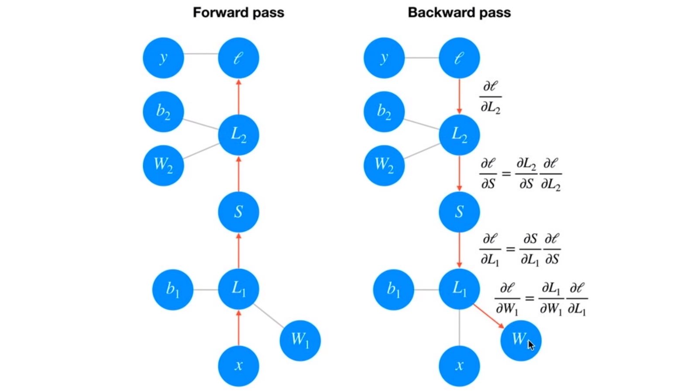

# Lesson 4 - Introduction to PyTorch

It is mandatory to inherit from `nn.Module` when you're creating a class for your network.

PyTorch networks created with `nn.Module` must have a `forward` method defined. It takes in a tensor `x` and passes it through the operations you defined in the `__init__` method.

[PyTorch Basic Operations Summary](https://jhui.github.io/2018/02/09/PyTorch-Basic-operations/)

* `*` does element-wise multiplication.
* `@` does matrix multiplication, like A.mm(B). `.matmul` is an alias. `.mm` does not broadcast.

`torch.dot()` treats both objects as 1D vectors (irrespective of their original shape) and computes their inner product.

In-place operators end with a `_`, eg `a.add_(b) == a = a + b`

All operators have an `out` parameter where the result is stored: `torch.add(x, y, out=r1)`

`.numpy()` and `.from_numpy()` convert to/from numpy format. PyTorch uses the same memory layout, and by default the objects are not duplicated.

* `.reshape()` will sometimes return the same memory range, and sometimes a clone
* `.view((<shape>))` to reshape a tensor without changing it. Complains if the shape is invalid.
* `.resize()` can drop or add elements to satisify the given shape.

Set a random seed:

```
torch.manual_seed(1)
if torch.cuda.is_available:
    torch.cuda.manual_seed_all(1)
```

The default datatype of a tensor is `long`.

This course has the weight matrices arranged transposed compared to Andrew Ng:


Instead of  it is: 


### Part 2 - Neural Networks in Pytorch

Display an image:
```
import matplotlib.pyplot as plt
plt.imshow(images[1].numpy().squeeze(), cmap='Greys_r');
```
The first argument is expected to be matrix.

Weights: `model.fc1.weight`
Bias: `print(model.fc1.bias)`

```
# Set biases to all zeros
model.fc1.bias.data.fill_(0)

# Sample from random normal with standard dev = 0.01
model.fc1.weight.data.normal_(std=0.01)
```
## Part 3 - Training Neural Networks

### Gradient Descent



<p align="center"></p>

**Note:** I'm glossing over a few details here that require some knowledge of vector calculus, but they aren't necessary to understand what's going on.

We update our weights using this gradient with some learning rate . 

<p align="center"></p>

The learning rate  is set such that the weight update steps are small enough that the iterative method settles in a minimum.

### Losses in PyTorch

By convention, the loss function is assigned to: `criterion = nn.CrossEntropyLoss`.

The input to criterion functions is expected to be class scores, not probabilities.

[`nn.CrossEntropyLoss`](https://pytorch.org/docs/stable/nn.html#torch.nn.CrossEntropyLoss) criterion combines `nn.LogSoftmax()` and `nn.NLLLoss()` in one single class.

```
criterion = nn.CrossEntropyLoss()
...
# Calculate the loss with the pre-probability logits and the labels
loss = criterion(logits, labels)
```

It's recommend to use `log_softmax`, `criterion = nn.NLLLoss()`, and get prediction probabilities with `torch.exp(model(input))`.

### Autograd

Autograd works by keeping track of operations performed on tensors, then going backwards through those operations, calculating gradients along the way.

To make sure PyTorch keeps track of operations on a tensor and calculates the gradients, you need to set `requires_grad = True` on a tensor. You can do this at creation with the `requires_grad` keyword, or at any time with `x.requires_grad_(True)`.

You can turn off gradients for a block of code with the `torch.no_grad()` content:
```python
x = torch.zeros(1, requires_grad=True)
>>> with torch.no_grad():
...     y = x * 2
>>> y.requires_grad
False
```

Also, you can turn on or off gradients altogether with `torch.set_grad_enabled(True|False)`.

`.grad` shows a tensor's gradient as calculated by `loss.backward()`

`.grad_fn` shows the function used to calculate `.grad`, eg:
```
y = x**2
print(y.grad_fn)
```
   Gives: `<PowBackward0 object at 0x7f7ea8231a58>`

## Part 4 - Fashion-MNIST

```
from torch import nn, optim
import torch.nn.functional as F
```

The network can be defined as a subclass of `nn.Module`:
```
class Classifier(nn.Module):
    def __init__(self):
        super().__init__()
        self.fc1 = nn.Linear(784, 256)
        self.fc2 = nn.Linear(256, 128)
        self.fc3 = nn.Linear(128, 64)
        self.fc4 = nn.Linear(64, 10)

    def forward(self, x):
        # make sure input tensor is flattened
        x = x.view(x.shape[0], -1)

        x = F.relu(self.fc1(x))
        x = F.relu(self.fc2(x))
        x = F.relu(self.fc3(x))
        x = F.log_softmax(self.fc4(x), dim=1)

        return x
```

Note that `forward()` automatically resizes the images via `view()`.

Alternatively, simple models can be defined via `Sequential`:

```
model = nn.Sequential(nn.Linear(784, 384),
                      nn.ReLU(),
                      nn.Linear(384, 128),
                      nn.ReLU(),
                      nn.Linear(128, 10),
                      nn.LogSoftmax(dim=1))
```

### Create the network, define the criterion and optimizer
```
model = Classifier()
criterion = nn.NLLLoss()
optimizer = optim.Adam(model.parameters())
```

### Train a network
```
epochs = 5

for e in range(epochs):
    running_loss = 0
    for images, labels in trainloader:
        log_ps = model(images)
        loss = criterion(log_ps, labels)

        optimizer.zero_grad()
        loss.backward()
        optimizer.step()

        running_loss += loss.item()
    print(f"Training loss: {running_loss/len(trainloader)}")
```

## Part 5 - Inference and Validation

Todo

